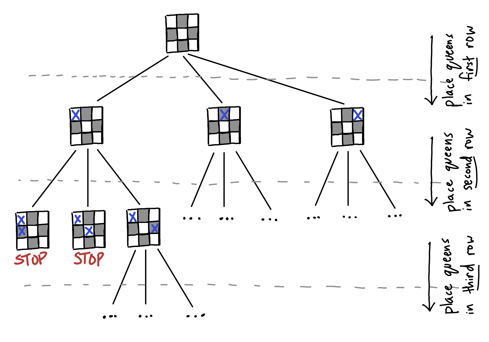

# PPA-S25 hw1

## Logistics

This homework consists of 100 points total, with points for individual
tasks as indicated below.

You should submit your work on Brightspace. (The Brightspace page for the
course will be created imminently; look out for an email from the instructor
and an announcement on Slack.)

Create a file `written.pdf` with your solutions to the written tasks, including
the speedup plots. Typeset solutions are preferred. Handwritten solutions will
be accepted only if they are **easily legible**.

Package your `written.pdf` with your `NQueensExt.sml` file as follows:
```bash
# replace NYU_NET_ID with your ID, e.g., shw8119
$ tar czf NYU_NET_ID.tgz NQueensExt.sml written.pdf
```

The resulting `.tgz` archive should contain only `NQueensExt.sml` and
`written.pdf`. To submit, upload this `.tgz` file.

**DUE DATE**: This submission is due at **5:00pm EST on Monday, Feb 3**. Course
policy on late submissions is available on the course website.
(https://cs.nyu.edu/~shw8119/courses/s25/3033-121-ppa/)

## Setup

* Follow the instructions on the course website to access one of the `crunchy`
compute servers.
* Install MaPLe. For the `crunchy` servers, you can:
    - Download https://cs.nyu.edu/~shw8119/courses/s25/3033-121-ppa/resources/mpl-v053.tgz and copy it to the server
    - Unpack by running `tar xzf mpl-v053.tgz`. This will create a directory
    `mpl-v053/`
    - The compiler, `mpl`, is located at `mpl-v053/bin/mpl`
    - Add `mpl-v053/bin` to your `PATH` so that you can access it easily:
    `export PATH="$(pwd -P)/mpl-v053/bin:$PATH"`. We recommend updating your
    `~/.bashrc` file or other configuration file as appropriate.

## A Fun Place to Start: N-Queens

The [N-Queens problem](https://en.wikipedia.org/wiki/Eight_queens_puzzle) is
a fun mathematical curiosity which asks: how many different ways can
$N$ queens be placed on an $N \times N$ chessboard, such that no queen can
take another in a single move?

This is a nice "hello world" problem for parallel computing, so let's play with
it.

To count the number of solutions, we could use a brute-force approach.
The idea would be to consider all possible placements of $N$ queens
and check to see in each case if any queen is threatened. This approach can be
naturally parallelized because each potential placement of queens can be checked
independently.

To be a bit more efficient, rather than generating *all* possible placements of
queens on the board, we can instead attempt to consider only the placements
that have *at most one pair* of threatened queens.

The idea is to start with an empty board and then generate $N$ children,
each of which has a queen in a different column of the *first* row. Each of
those children then has $N$ more children, where we attempt to place a queen in
each column of the *second* row, and so on. Whenever a potential placement
has a threatened queen, we don't need to consider any of its children.

For example, here is picture showing the beginning of this algorithm for
$N=3$. The example shows 7 boards, and 2 of these have threatened queens, so 
we don't need to consider any of their children. For each of the "..." in
the picture, the search is incomplete.


✍️ **Task 1 (10 points)**: Complete the search tree above (you may want to do
this on a whiteboard, but you don't need to submit any drawings). How big is
the tree? That is, how many boards needed to be considered?

✍️ **Task 2 (5 points)**: How many solutions to the $N$-queens problem are there
for $N=3$?

### Scheduling

Suppose it takes 1 unit of time to process one board in the search tree.
Processing a board has two possible outcomes: either (1) a threatened queen is
found, or (2) the children are generated.

On the first time step, we can process the root of the
tree. At the second time step, we can process one of the generated children,
etc. Note that there is a dependence here that we cannot break:
**a child cannot be processed until after its parent has been processed.**

If we have more than one processor, and if multiple children are waiting to
be processed, then we can process multiple boards simultaneously (in parallel).

✍️ **Task 3 (10 points)**: Suppose you have 2 identical processors. What is
the minimum possible amount of time it would take to process every board in
the search tree for $N=3$? (Assume processing one board takes 1 unit of time.)

✍️ **Task 4 (10 points)**: Now suppose you have 3 identical processors. Similar
to Task 3, what is the minimum possible amount of time?

### A Parallelized Search

Take a look at the file `NQueens.sml`. The function `count_solutions(size)` in
this file implements the algorithm described above and counts the number of
solutions (where `size = N`). It does so by creating tasks to search through
the children of every board in parallel, and adding up the results.

✍️ **Task 5 (15 points)**: Compile, run, and create a speedup plot for this
code using 1-32 processors on input size $N=13$. See the instructions below.
Each run will report the average run-time across 5 repetitions and will print
out the number of solutions. Use the command-line arguments `@mpl procs <P> --`,
replacing `<P>` with the desired number of processors.
For $N=13$, it should say there are 73,712 solutions.
```bash
$ make main
$ ./main @mpl procs 1 -- -n 13 -warmup 1 -repeat 5
$ ./main @mpl procs 2 -- -n 13 -warmup 1 -repeat 5
# ... and so on ...
```
You can run this command to automatically step through every processor count
between 1-32 and only report the average:
```bash
$ for p in $(seq 1 32); do echo -n "procs $p "; ./main @mpl procs $p -- -n 13 -warmup 1 -repeat 5 | grep average; done
```
Let $T(P)$ be the amount of time it takes to run on $P$ processors, and define
$speedup(P) = T(1)/T(P)$. **Your task is to make a speedup plot, where the
X-axis is the number of processors (ranging from 1 to 32), and the Y-axis is
$speedup(P)$.**

(Note: I've found that ChatGPT is pretty good at making speedup plots if you
copy/paste the data you collect and ask nicely... or, feel free to make
the plot however you'd like!)

### A Modified Search

The code in `NQueens.sml` only counts the number of solutions. Your next task
is to create a new search which not only counts the number of solutions but
also counts the number of boards considered.

✍️ **Task 6 (35 points)**: In `NQueensExt.sml`, implement the function
`count_solutions_and_boards(size)`. It should return a tuple $(n_s, n_b)$,
where $n_s$ is the number of solutions and $n_b$ is the number of boards
considered by the search.

Don't modify `NQueens.sml`. We recommend copy/pasting code from
`NQueens.sml` into `NQueensExt.sml` and then modifying it as you see fit.
As a hint, consider implementing a new helper function
`parallel_sum_tuples(lo, hi, f)` which expects the function `f(...)` to
return a tuple of integers and sums them up. **If you have questions about
the language (e.g. compile errors or questions about the syntax, etc.),
ask on Slack!**

To do a bit of unit testing, you can run the following.
Feel free to add more tests at the top of `test-ext.sml`.
```
$ make test-ext
$ ./test-ext 
```

You can test the performance of your code as follows, using the `--ext` flag
to tell the benchmark drive to run your `NQueensExt.sml` code instead of
`NQueens.sml`.
```
$ make main
$ ./main @mpl procs 8 -- -n 13 -warmup 1 -repeat 5 --ext
```

✍️ **Task 7 (15 points)**: Similar to Task 5, create a speedup plot for your
new `count_solutions_and_boards(size)` function.
You can run this command to automatically step through every processor count
between 1-32 and only report the average:
```bash
$ for p in $(seq 1 32); do echo -n "procs $p "; ./main @mpl procs $p -- -n 13 -warmup 1 -repeat 5 --ext | grep average; done
```